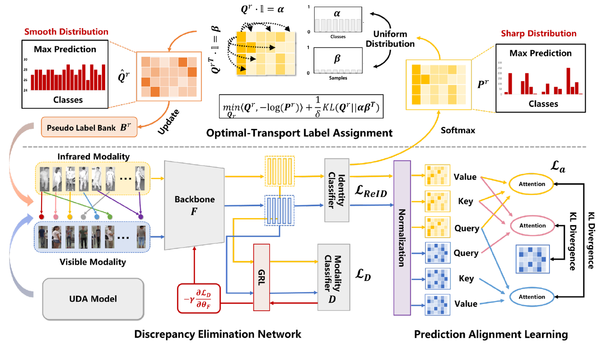

# Optimal Transport for Label-Efficient Visible-Infrared Person Re-Identification (OTLA-ReID)
This is Official Repository for "Optimal Transport for Label-Efficient
Visible-Infrared Person Re-Identification" ([PDF](https://www.ecva.net/papers/eccv_2022/papers_ECCV/papers/136840091.pdf), [Supplementary Material](https://www.ecva.net/papers/eccv_2022/papers_ECCV/papers/136840091-supp.pdf)), which is accepted by *ECCV 2022*. This work is done at the DMCV Laboratory of East China Normal University. You can link at [DMCV-Lab](https://dmcv-ecnu.github.io/) to find DMCV Laboratory website page.



### Update:
**[2022-7-17]** Semi-supervised setting and supervised setting can be run with current code. Unsupervised setting will be updated with a few of days.

**[2022-7-21]** Update some critical informtion of REAMDE.md.

**[2022-9-22]** Update the code of SpCL-master, which can be used to generator pseudo labels of visible modality for unsupervised setting.

**[2022-10-28]** Update the paper link.


## Requirements
+ python 3.7.11
+ numpy 1.21.4
+ torch 1.10.0
+ torchvision 0.11.0
+ easydict 1.9
+ PyYAML 6.0
+ tensorboardX 2.2


## Prepare Datasets
Download the VI-ReID datasets [SYSU-MM01](https://github.com/wuancong/SYSU-MM01) (Email the author to get it) and [RegDB](http://dm.dongguk.edu/link.html) (Submit a copyright form). follow the link of [DDAG](https://github.com/mangye16/DDAG) to obtain more information of VI-ReID datasets. Download visible ReID datasets [Market-1501](https://drive.google.com/file/d/0B8-rUzbwVRk0c054eEozWG9COHM/view), [MSMT17](https://arxiv.org/abs/1711.08565) (Email the author to get it), [DukeMTMC-reID](https://drive.google.com/file/d/1jjE85dRCMOgRtvJ5RQV9-Afs-2_5dY3O/view) if you want to run unsupervised setting. Please follow the link of [OpenUnReID](https://github.com/open-mmlab/OpenUnReID/blob/master/docs/INSTALL.md) to obtain more information of visible ReID datasets.


## Training
You need to firstly choose the ```setting:``` of config file corresponding VI-ReID dataset.

+ For ```semi-supervised``` / ```supervised``` setting, if you want to train the model(s) in the paper, run following command:
```shell
cd OTLA-ReID/
python main_train.py --config config/config_sysu.yaml
```
+ For ```unsupervised``` setting, you should write the right path of ```train_visible_image_path:``` and ```train_visible_label_path:``` , which are the produced visible data and pseudo label path of VI-ReID datasets by well-established UDA-ReID or USL-ReID methods (e.g. [SpCL](https://github.com/yxgeee/SpCL)). Then run following command:
```shell
cd OTLA-ReID/
python main_train.py --config config/config_sysu.yaml
```

Here, we give an example of running SpCL to generate visible pseudo label in SpCL-master. However, you firstly need to install environment which can be found in [SpCL](https://github.com/yxgeee/SpCL):
+ For SYSU-MM01:
```shell
cd OTLA-ReID/SpCL-master/
CUDA_VISIBLE_DEVICES=0,1,2,3 python examples/spcl_train_uda.py -ds market1501 -dt sysumm01_rgb --logs-dir logs/spcl_uda/market1501TOsysumm01_rgb_resnet50 --epochs 51 --iters 800
```
+ For RegDB:
```shell
cd OTLA-ReID/SpCL-master/
CUDA_VISIBLE_DEVICES=0,1,2,3 python examples/spcl_train_uda.py -ds market1501 -dt regdb_rgb --logs-dir logs/spcl_uda/regdbTOsysumm01_rgb_resnet50 --epochs 51 --iters 50
```
The generated visible images and visible pseudo labels are both saved under the dataset directory.

## Testing
If you want to test the trained model(s), run following command:
```shell
cd OTLA-ReID/
python main_test.py --config config/config_sysu.yaml --resume --resume_path ./sysu_semi-supervised_otla-reid/sysu_save_model/best_checkpoint.pth
```

## Citation
If you find this code useful for your research, please cite our paper:
```
@inproceedings{wang2022optimal,
  title={Optimal Transport for Label-Efficient Visible-Infrared Person Re-Identification},
  author={Wang, Jiangming and Zhang, Zhizhong and Chen, Mingang and Zhang, Yi and Wang, Cong and Sheng, Bin and Qu, Yanyun and Xie, Yuan},
  booktitle={European Conference on Computer Vision},
  pages={93--109},
  year={2022},
  organization={Springer}
}
```

## Acknowledgements
This work is developed based on repositories of [SeLa(ICLR 2020)](https://github.com/yukimasano/self-label), [DDAG(ECCV 2020)](https://github.com/mangye16/DDAG), [SpCL(NIPS 2020)](https://github.com/yxgeee/SpCL), [MMT(ICLR 2020)](https://github.com/yxgeee/MMT), [HCD(ICCV 2021)](https://github.com/tangshixiang/HCD). We sincerely thanks all developers of these high-quality repositories.
